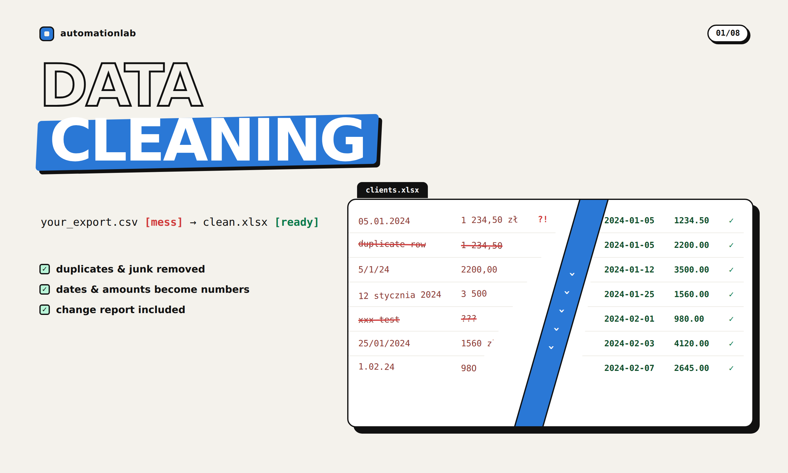
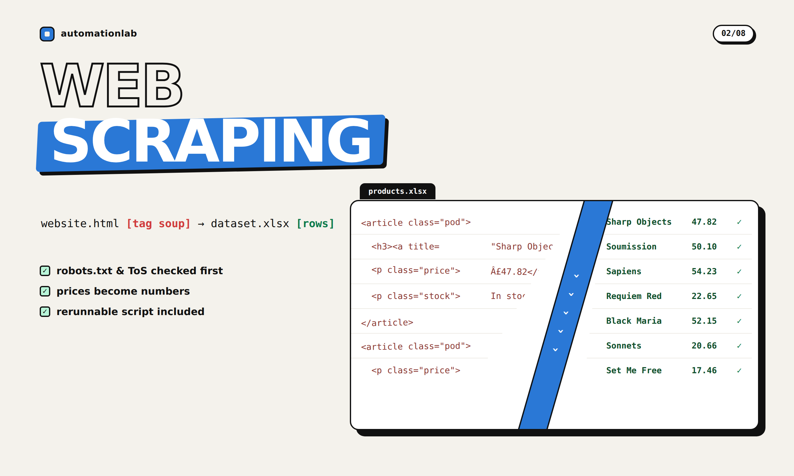
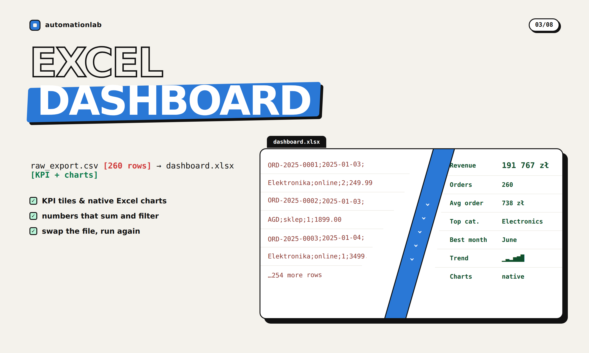
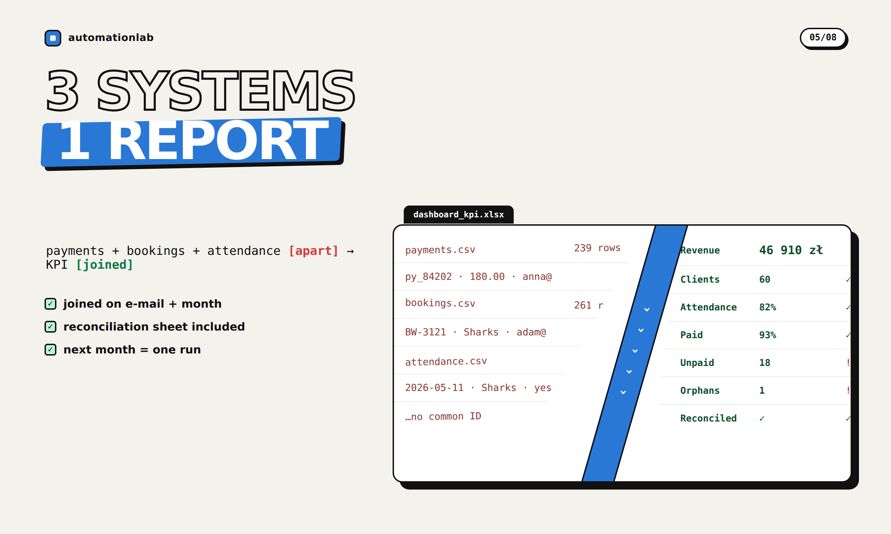
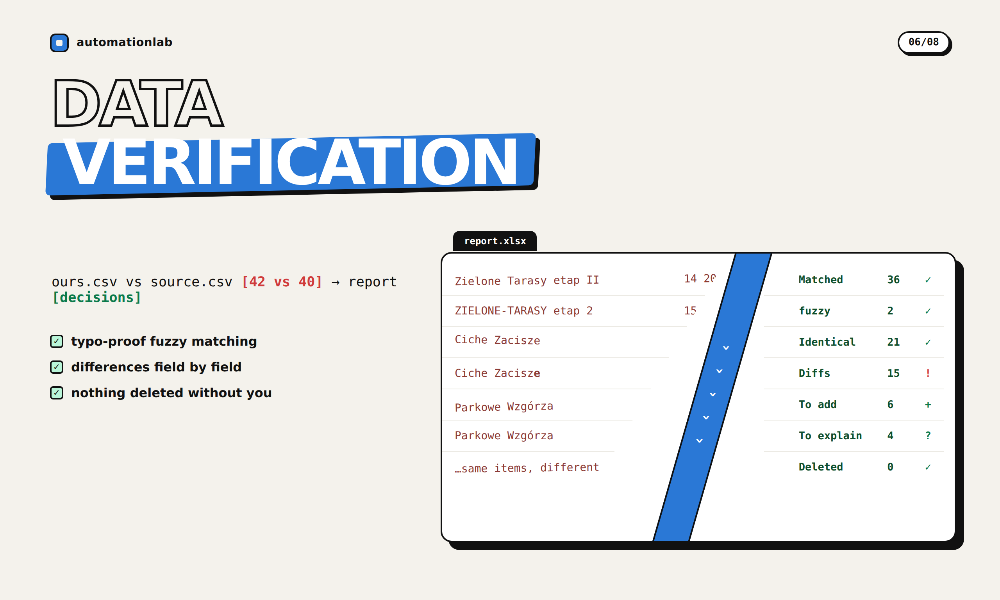
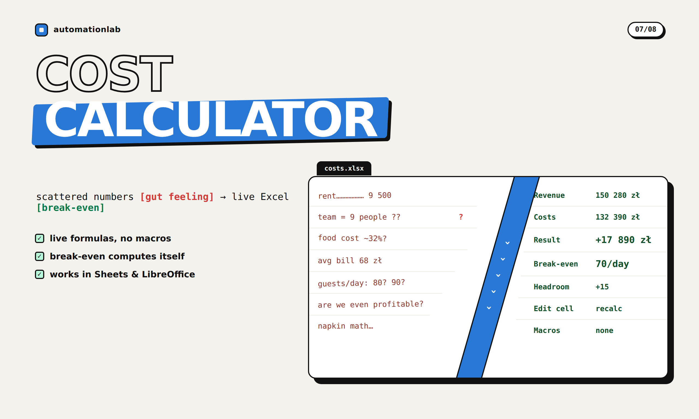
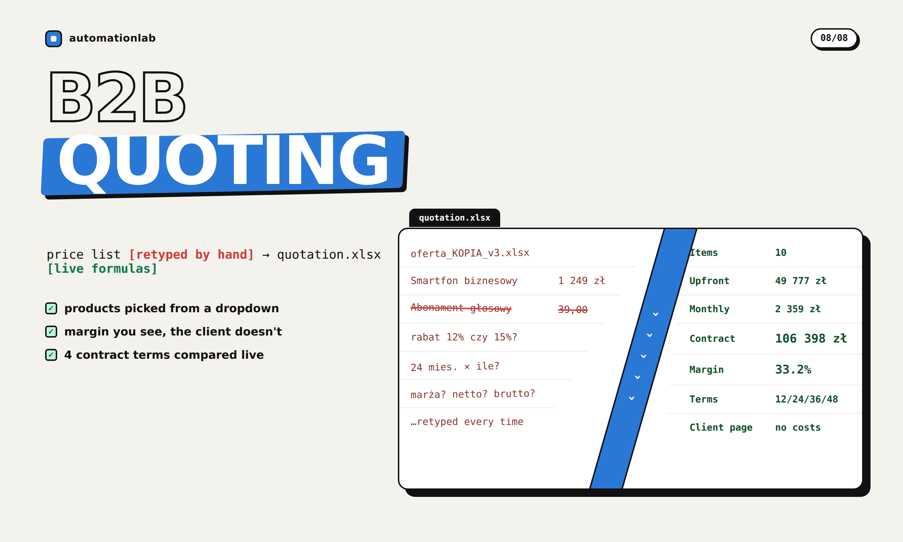

# automationlab — data & automation, delivered as ready-to-use files

I build **small, finished tools**: cleaned datasets, web-scraped data, Excel
dashboards, PDF-to-Excel extractors, one-off Python scripts. You get a file that
works — nothing to install, nothing to configure on your side.

**Stack:** Python · pandas · openpyxl · BeautifulSoup · pdfplumber

> Every example below is fully runnable. All data is fictional or comes from
> public scraping sandboxes. Finished output files are committed in each
> project's `output/` folder, so you can open the real deliverables.
> Demo data is in Polish (my home market) — your delivery matches the language
> of your data. Code, docs and communication: English or Polish, your pick.

---

## Projects

### 01 · Data cleaning — messy CSV → analysis-ready Excel
Five date formats, prices like "1 234,50 zł", duplicates and junk rows — turned
into a clean, sorted register plus a change report.

[](01-data-cleaning/)

**[→ 01-data-cleaning](01-data-cleaning/)** · pandas, openpyxl

---

### 02 · Web scraping — website → ready dataset
Product listings collected politely (User-Agent, delays, error handling) into
a clean XLSX/CSV with prices as numbers.

[](02-web-scraper-dataset/)

**[→ 02-web-scraper-dataset](02-web-scraper-dataset/)** · requests, BeautifulSoup

---

### 03 · Excel dashboard — raw transactions → KPI report
One script turns a transaction export into a formatted workbook: KPI tiles,
monthly & category charts with data bars, filterable raw data.

[](03-excel-dashboard/)

**[→ 03-excel-dashboard](03-excel-dashboard/)** · openpyxl (native Excel charts)

---

### 04 · PDF invoices → searchable Excel register
A folder of invoice PDFs becomes one register: header fields + every line item,
amounts as real numbers. Includes coordinate-based parsing of two-column layouts.

[](04-pdf-to-excel/)

**[→ 04-pdf-to-excel](04-pdf-to-excel/)** · pdfplumber, openpyxl

---

### 05 · KPI dashboard from three systems
Payments, bookings and attendance exports merged on email + month into one
Excel dashboard, with a reconciliation sheet for records the systems disagree on.

[](05-kpi-dashboard-3-sources/)

**[→ 05-kpi-dashboard-3-sources](05-kpi-dashboard-3-sources/)** · openpyxl, multi-source merge

---

### 06 · Database verification against an external source
Two files describing the same items in different spellings. Fuzzy matching
pairs them up and a field-by-field diff report shows what to fix, add or explain.

[](06-database-verification/)

**[→ 06-database-verification](06-database-verification/)** · difflib fuzzy matching, openpyxl

---

### 07 · Restaurant cost calculator (live Excel tool)
A cost model driven by named ranges and formulas: edit the yellow assumption
cells and costs, profit and the break-even point recalculate inside Excel.

[](07-restaurant-cost-calculator/)

**[→ 07-restaurant-cost-calculator](07-restaurant-cost-calculator/)** · openpyxl, formulas + named ranges

---

### 08 · B2B quoting system — catalogue → priced quote
Products come from a dropdown fed by the price list; quantities, discounts and
the contract term are the only things typed in. Totals, margin, a 12/24/36/48-month
comparison and a print-ready customer page recalculate by themselves.

[](08-quoting-system/)

**[→ 08-quoting-system](08-quoting-system/)** · openpyxl, INDEX/MATCH + data validation

---

## Running the examples

Every project has the same shape: `input/` (source data) → one script →
`output/` (the finished file). Nothing is hidden behind a build step.

```bash
pip install -r requirements.txt
cd 01-data-cleaning && python3 clean.py
```

| # | Project | Command |
|---|---------|---------|
| 01 | Data cleaning | `python3 clean.py` |
| 02 | Web scraping | `python3 scraper.py` (`--pages 5` for more) |
| 03 | Excel dashboard | `python3 dashboard.py` |
| 04 | PDF → Excel | `python3 extract.py` |
| 05 | KPI from 3 systems | `python3 kpi_dashboard.py` |
| 06 | Database verification | `python3 verify.py` |
| 07 | Cost calculator | `python3 calculator.py` |
| 08 | Quoting system | `python3 quote.py` |

## How I work

- **You get a result, not hours.** Fixed price, delivery date up front, a ready
  file at the end. Short written spec, async communication.
- **Nothing to deploy.** Deliverables are standalone files (script + output +
  short usage notes). No access to your systems needed.
- **Sensitive data:** I work on fictional/anonymized samples; full data only
  after we have an agreement through the platform (escrow).
- 2 revision rounds included by default.

## Typical jobs

Cleaning & deduplicating spreadsheets · scraping product/offer data into Excel ·
building report generators & dashboards · extracting tables from PDFs ·
one-off Python scripts (format conversion, file processing, small automations).

*Polski klient? Pracuję po polsku — każdy projekt ma polskie streszczenie na
dole swojego README, a dane demo są po polsku.*
